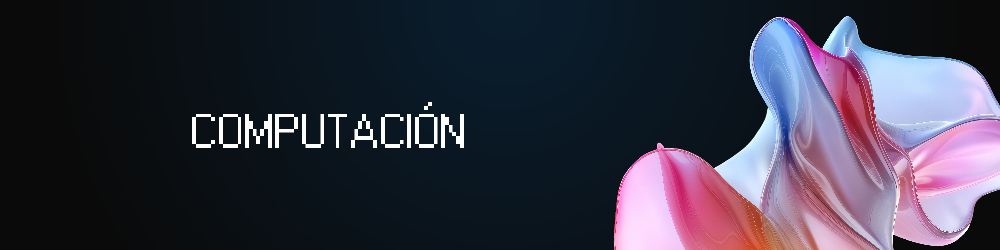

<h1 align="center">
  <a name="logo"></a>
</h1>


<h4 align="center">¿Este repo te fue útil? Dale una ⭐
  </br> 
  Si encontrás algún error o querés colaborar con el proyecto, hacé un 
  <a href="https://github.com/davidgimenezs/computacion">pull request</a>!
</h4>

## 📚 ¿Qué es Computación?
Computación es una materia introductoria en la formación de cualquier estudiante de ingeniería. Su objetivo principal es enseñar los conceptos básicos de la programación usando C++, desde variables y estructuras de control hasta el manejo de punteros y estructuras de datos avanzadas.

## 🤔 ¿Por qué usamos C++ en computación?
Usamos C++ porque es un lenguaje poderoso y eficiente que permite entender los fundamentos de la programación a bajo nivel. Su sintaxis estricta ayuda a desarrollar buenas prácticas de programación desde el inicio. Además, es ampliamente usado en la industria para aplicaciones que requieren alto rendimiento.

## 🧠 ¿Cómo se usa C++ en computación?
Se usa como herramienta fundamental para resolver problemas. Por ejemplo:

- Usamos ***variables y tipos de datos*** para almacenar información de manera eficiente.
- Usamos ***estructuras condicionales y bucles*** para controlar el flujo del programa.
- Usamos ***funciones y recursividad*** para modularizar y reutilizar código.
- Usamos ***arrays unidimensionales y multidimensionales*** para organizar datos.
- Usamos ***punteros*** para manejar memoria de forma directa y eficiente.
- Usamos ***estructuras*** para crear tipos de datos personalizados.
- Usamos ***algoritmos de ordenación y búsqueda*** para trabajar eficientemente con datos.

En programación real, cada concepto tiene casos ideales de uso, y parte del aprendizaje es saber cuándo conviene usar cada uno.

## Clase 1 - Introducción a C++

|  #  |  Título  |  Dificultad                 
|-----|----------|--------------
|1|[Hola Mundo](Clase1/HolaMundo.cpp) | 🟢 Fácil
|2|[Hola Mundo 2](Clase1/HolaMundo2.cpp) | 🟢 Fácil
|3|[Cout](Clase1/cout.cpp) | 🟢 Fácil
|4|[Cout 2](Clase1/cout2.cpp) | 🟢 Fácil
|5|[Cout 3](Clase1/cout3.cpp) | 🟢 Fácil
|6|[ASCII](Clase1/ascii.cpp) | 🟢 Fácil
|7|[Imprimir Mensaje](Clase1/imprimirmensaje.cpp) | 🟢 Fácil
|8|[Suma](Clase1/suma.cpp) | 🟢 Fácil
|9|[Tamaño](Clase1/tamanho.cpp) | 🟢 Fácil

## Clase 2 - Estructuras de Control (Selección)

|  #  |  Título  |  Dificultad                 
|-----|----------|--------------
|10|[Ejercicio 1.1](Clase2/Ejercicio1_1.cpp) | 🟢 Fácil
|11|[Ejercicio 1.2](Clase2/Ejercicio1_2.cpp) | 🟢 Fácil
|12|[Ejercicio 1.3](Clase2/Ejercicio1_3.cpp) | 🟢 Fácil
|13|[If Ejemplo 1](Clase2/If_Ejemplo1.cpp) | 🟢 Fácil
|14|[If Ejemplo 2](Clase2/If_Ejemplo2.cpp) | 🟢 Fácil
|15|[If Ejemplo 3](Clase2/If_Ejemplo3.cpp) | 🟢 Fácil
|16|[If Test](Clase2/If_Test.cpp) | 🟡 Intermedio
|17|[Simple](Clase2/simple.cpp) | 🟢 Fácil
|18|[Switch Ejemplo](Clase2/Switch_Ejemplo.cpp) | 🟡 Intermedio

## Clase 3 - Estructuras de Control (Repetición)

|  #  |  Título  |  Dificultad                 
|-----|----------|--------------
|19|[Números Aleatorios](Clase3/Ejemplo_NrosAleatorios.cpp) | 🟡 Intermedio
|20|[Ejemplo 1](Clase3/Ejemplo1.cpp) | 🟢 Fácil
|21|[Ejemplo 2](Clase3/Ejemplo2.cpp) | 🟢 Fácil
|22|[Ejemplo 2.2](Clase3/Ejemplo2_2.cpp) | 🟢 Fácil
|23|[Ejemplo 3.1](Clase3/Ejemplo3_1.cpp) | 🟡 Intermedio
|24|[Ejemplo 3.2](Clase3/Ejemplo3_2.cpp) | 🟡 Intermedio
|25|[Ejemplo 4.1](Clase3/Ejemplo4_1.cpp) | 🟡 Intermedio
|26|[Ejemplo 4.2](Clase3/Ejemplo4_2.cpp) | 🟡 Intermedio
|27|[Ejemplo 5](Clase3/Ejemplo5.cpp) | 🟡 Intermedio
|28|[Ejemplo 6](Clase3/Ejemplo6.cpp) | 🟡 Intermedio
|29|[Ejemplo 7](Clase3/Ejemplo7.cpp) | 🟡 Intermedio
|30|[Ejemplo 8](Clase3/Ejemplo8.cpp) | 🟡 Intermedio
|31|[Ejemplo 9](Clase3/Ejemplo9.cpp) | 🟡 Intermedio

## Clase 4 - Funciones y Recursividad

|  #  |  Título  |  Dificultad                 
|-----|----------|--------------
|32|[Potencia](Clase4/Ejemplo1_Potencia.cpp) | 🟡 Intermedio
|33|[Sumas](Clase4/Ejemplo2_Sumas.cpp) | 🟡 Intermedio
|34|[Fibonacci Iterativo](Clase4/Ejemplo3_Fibonacci_Iterativo.cpp) | 🟡 Intermedio
|35|[Fibonacci Recursivo](Clase4/Ejemplo3_Fibonacci_Recursivo.cpp) | 🔴 Difícil
|36|[MCD Iterativo](Clase4/Ejercicio1_MCD_Iter.cpp) | 🟡 Intermedio
|37|[MCD Recursivo 1](Clase4/Ejercicio1_MCD_Rec_1.cpp) | 🔴 Difícil
|38|[MCD Recursivo 2](Clase4/Ejercicio1_MCD_Rec_2.cpp) | 🔴 Difícil
|39|[Monedas](Clase4/Ejercicio2_Monedas.cpp) | 🟡 Intermedio
|40|[Torres de Hanoi](Clase4/TorresDeHanoi.cpp) | 🔴 Difícil

## Clase 5 - Arrays Unidimensionales

|  #  |  Título  |  Dificultad                 
|-----|----------|--------------
|41|[Notas de Clase](Clase5/Ejemplo1_NotasClase.cpp) | 🟡 Intermedio
|42|[Temperaturas](Clase5/Ejemplo2_Temperaturas.cpp) | 🟡 Intermedio
|43|[Magnitud](Clase5/Ejemplo3_Magnitud.cpp) | 🟡 Intermedio
|44|[Producto Escalar](Clase5/Ejemplo4_ProductoEscalar.cpp) | 🟡 Intermedio
|45|[Producto Escalar Modificado](Clase5/Ejemplo4_ProductoEscalar_Mod.cpp) | 🟡 Intermedio
|46|[Rotación](Clase5/Ejemplo5_Rotacion.cpp) | 🔴 Difícil

## Clase 6 - Ejercicios de Arrays

|  #  |  Título  |  Dificultad                 
|-----|----------|--------------
|47|[Ejercicio 1](Clase6/Ejercicio1.cpp) | 🟡 Intermedio
|48|[Ejercicio 2](Clase6/Ejercicio2.cpp) | 🟡 Intermedio
|49|[Ejercicio 3](Clase6/Ejercicio3.cpp) | 🔴 Difícil

## Clase 7 - Algoritmos de Ordenación y Búsqueda

|  #  |  Título  |  Dificultad                 
|-----|----------|--------------
|50|[Burbuja](Clase7/Burbuja.cpp) | 🟡 Intermedio
|51|[Burbuja Mejorada](Clase7/BurbujaMejorada.cpp) | 🟡 Intermedio
|52|[Búsqueda Binaria](Clase7/busquedabinaria.cpp) | 🔴 Difícil
|53|[Ejercicio 1](Clase7/Ejercicio1.cpp) | 🟡 Intermedio
|54|[Ejercicio 2](Clase7/Ejercicio2.cpp) | 🟡 Intermedio
|55|[Inserción](Clase7/Insercion.cpp) | 🟡 Intermedio
|56|[Selección](Clase7/Seleccion.cpp) | 🟡 Intermedio
|57|[Selección Modificada](Clase7/SeleccionMod.cpp) | 🟡 Intermedio

## Clase 8 - Arrays Multidimensionales

|  #  |  Título  |  Dificultad                 
|-----|----------|--------------
|58|[Ejemplo 1](Clase8/Ejemplo1.cpp) | 🟡 Intermedio
|59|[Ejemplo 2](Clase8/Ejemplo2.cpp) | 🟡 Intermedio
|60|[Matriz Forma 1](Clase8/MatrizForma1.cpp) | 🟡 Intermedio
|61|[Matriz Forma 1 v2](Clase8/MatrizForma1_v2.cpp) | 🟡 Intermedio
|62|[Matriz Forma 2](Clase8/MatrizForma2.cpp) | 🟡 Intermedio
|63|[Matriz Forma 3](Clase8/MatrizForma3.cpp) | 🔴 Difícil
|64|[Sizeof](Clase8/sizeof.cpp) | 🟢 Fácil

## Clase 9 - Estructuras y Punteros

|  #  |  Título  |  Dificultad                 
|-----|----------|--------------
|65|[Atleta](Clase9/Atleta.cpp) | 🟡 Intermedio
|66|[Atleta Asignación 1](Clase9/Atleta_Asignacion1.cpp) | 🟡 Intermedio
|67|[Atleta Asignación 2](Clase9/Atleta_Asignacion2.cpp) | 🟡 Intermedio
|68|[Atleta Asignación Puntero](Clase9/Atleta_AsignacionPuntero.cpp) | 🔴 Difícil
|69|[Atleta Función](Clase9/Atleta_Funcion.cpp) | 🟡 Intermedio
|70|[Atleta Función Punteros](Clase9/Atleta_Funcion_Punteros.cpp) | 🔴 Difícil
|71|[Ejemplo Complejo](Clase9/Ejemplo_Complejo.cpp) | 🔴 Difícil
|72|[Enumeración](Clase9/Enumeracion.cpp) | 🟡 Intermedio
|73|[Enumeración Ordenamiento](Clase9/Enumeracion_Ordenamiento.cpp) | 🔴 Difícil
|74|[Unión](Clase9/Union.cpp) | 🟡 Intermedio

## Clase 10 - Cadenas

|  #  |  Título  |  Dificultad                 
|-----|----------|--------------
|75|[Copiar](Clase10/copiar.cpp) | 🟡 Intermedio
|76|[Definir Cadena](Clase10/definircadena.cpp) | 🟢 Fácil

## Desafíos

|  #  |  Título  |  Dificultad                 
|-----|----------|--------------
|77|[Semana 2](Desafios/semana2.cpp) | 🟡 Intermedio
|78|[Semana 3](Desafios/semana3.cpp) | 🟡 Intermedio
|79|[Semana 5](Desafios/semana5.cpp) | 🔴 Difícil
|80|[Semana 6](Desafios/semana6.cpp) | 🔴 Difícil
|81|[Semana 7](Desafios/semana7.cpp) | 🔴 Difícil
|82|[Semana 8](Desafios/semana8.cpp) | 🔴 Difícil
|83|[Semana 9](Desafios/semana9.cpp) | 🔴 Difícil
|84|[Semana 10](Desafios/semana10.cpp) | 🔴 Difícil

## Exámenes 2020

|  #  |  Título  |  Dificultad                 
|-----|----------|--------------
|85|[Parcial 1](Examenes2020/Parcial1.cpp) | 🔴 Difícil
|86|[Parcial 2](Examenes2020/Parcial2.cpp) | 🔴 Difícil
|87|[Parcial 3](Examenes2020/Parcial3.cpp) | 🔴 Difícil
|88|[Parcial 4](Examenes2020/Parcial4.cpp) | 🔴 Difícil

## 🛠️ Instrucciones de uso

1. Cloná el repositorio en tu máquina local:
   ```bash
   git clone https://github.com/davidgimenezs/computacion.git
   ```

2. Navegá a la carpeta del repositorio:
   ```bash
   cd computacion
   ```

3. Compilá cualquier archivo C++:
   ```bash
   g++ -o programa Clase1/HolaMundo.cpp
   ```

4. Ejecutá el programa compilado:
   ```bash
   ./programa
   ```

## 📋 Requisitos

- **Compilador C++**: GCC, Clang, o Visual Studio
- **Editor**: VS Code, Dev-C++, Code::Blocks, o cualquier editor de texto
- **Sistema Operativo**: Windows, Linux, o macOS

## 🤝 Colaboración
Si encontrás algún error o querés agregar algo al proyecto, ¡estás más que bienvenido! Hacé un [pull request](https://github.com/davidgimenezs/computacion/pulls) con tus mejoras, correcciones o nuevos ejercicios y lo reviso sin problema.

## 📄 Licencia
Este proyecto está bajo la licencia MIT - podés ver más detalles en el archivo LICENSE.
